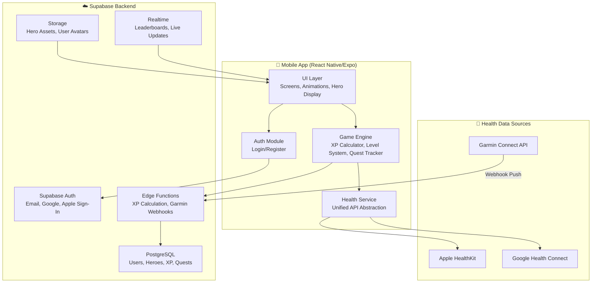

# Arete — Gamified Fitness RPG

> *Train like a legend. Become one.*

A mobile app that syncs with Apple Health and Garmin, converts real-world fitness activity into XP, and lets users grow a character avatar modeled after mythic and historical heroes.

---

## High-Level Concept

Users connect their health data sources (Apple Health, Garmin), and every step, workout, and active minute earns XP toward leveling up a chosen **Hero** — a character inspired by figures like Hercules, Achilles, Mulan, Miyamoto Musashi, Atalanta, or Cú Chulainn. As the hero levels up, they unlock new visual forms (tiers), abilities (representing fitness milestones), and quests. The app is bright, flashy, and designed to feel like opening a mobile RPG — not a spreadsheet.

---

## User Review Required

> [!IMPORTANT]
> **Apple Developer Account** — Publishing to the App Store (and testing HealthKit) requires an Apple Developer account ($99/year). Do you have one, or should we plan around this?
- I do not have one. I can add one as we get closer.

> [!IMPORTANT]  
> **Garmin Developer Program** — Accessing Garmin Connect health APIs requires applying to the Garmin Connect Developer Program (free, but requires approval for business use). This is a gating dependency — we can start without it and add Garmin in a later phase.
- I do not have one. I can add one as we get closer.

> [!WARNING]
> **Scope & Phasing** — This is a large project. The plan below is broken into **4 phases**. I recommend we build Phase 1 (core loop) first and iterate. Are you comfortable with a phased approach, or do you want everything in one pass?
- Aligned. I want to be able to just use this for myself for a while and then we can think about scaling. Let's build so I can reset myself or update my status frequently to test different scenarios.

---

## Open Questions

1. **Platform Priority** — iOS-first, Android-first, or both simultaneously? Apple Health is iOS-only; Android uses Google Health Connect. Building both from day one adds ~30% effort.
- iOS-first.
2. **Hero Art Style** — Do you want to generate hero artwork (I can create these with the image generation tool), source from an asset marketplace, or use a stylized pixel/vector art approach?
- Let's generate the images using Claude Image Gen. We can start with the initial roster. PoC is more important for now than specifics
3. **Monetization** — Any plans for in-app purchases, subscriptions, or ads? This affects architecture (e.g., RevenueCat integration).
- Not yet. Just an MVP for now.
4. **Social Features** — Do you want leaderboards, guilds/parties, friend challenges? These are common in fitness gamification but add significant backend complexity.
- Not for now. Just an MVP for now.
5. **Offline Support** — Should the app work fully offline and sync when reconnected?
- Not for now. Just an MVP for now.

---

## Proposed Tech Stack

| Layer | Technology | Why |
|:---|:---|:---|
| **Framework** | React Native + Expo (SDK 55+) | Cross-platform, massive ecosystem, file-based routing via Expo Router |
| **Language** | TypeScript | Type safety for complex game state and health data |
| **Styling** | NativeWind (Tailwind for RN) | Rapid UI development, consistent design tokens |
| **Animations** | React Native Reanimated + Lottie | Smooth 60fps animations for level-ups, XP gains, hero reveals |
| **Backend** | Supabase (PostgreSQL + Auth + Edge Functions + Realtime) | Full BaaS — auth, database, serverless functions, real-time subscriptions |
| **Health (iOS)** | `react-native-health` or `@kingstinct/react-native-healthkit` | Industry-standard HealthKit bridge |
| **Health (Android)** | `react-native-health-connect` | Google Health Connect bridge |
| **Garmin** | Garmin Connect API (OAuth 2.0 + server-side sync) | Webhook-based data push to Supabase Edge Functions |
| **State** | TanStack Query + Zustand | Server state caching + lightweight client state |
| **Local Storage** | MMKV | Ultra-fast key-value storage for offline caching |
| **Builds** | EAS (Expo Application Services) | Cloud builds, OTA updates, TestFlight/Play Store distribution |
| **Error Monitoring** | Sentry | Crash reporting & performance |

---

## Architecture Overview



---

## Gamification System Design

### Hero Characters (Initial Roster)

Each hero has a **class** that determines which fitness stats scale their progression:

| Hero | Origin | Class | Primary Stat | Secondary Stat |
|:---|:---|:---|:---|:---|
| **Hercules** | Greek Myth | Warrior | Strength Workouts | Total Active Minutes |
| **Atalanta** | Greek Myth | Runner | Running Distance | Steps |
| **Miyamoto Musashi** | Japanese History | Disciplined | Workout Consistency (Streaks) | Active Minutes |
| **Mulan** | Chinese Legend | All-Rounder | Varied Activity Types | Calories Burned |
| **Cú Chulainn** | Irish Myth | Berserker | High-Intensity Workouts | Heart Rate Zones |
| **Boudicca** | British History | Endurance | Cycling/Cardio Distance | Workout Duration |

### XP & Leveling System

```
Health Activity → Normalized Metrics → XP Formula → Hero Level
```

**XP Sources:**
- **Steps**: 1 XP per 100 steps
- **Active Minutes**: 2 XP per minute
- **Workouts logged**: 50 XP base + modifiers based on duration/intensity
- **Calories burned**: 1 XP per 10 active calories
- **Distance (run/cycle)**: 5 XP per km
- **Streak bonus**: +10% XP per consecutive day (caps at +100%)
- let's also add hill climbs: 5 XP per 100 ft of elevation gain

**Leveling Curve (progressive):**
```
Level N requires: 100 × N^1.5 total XP
Level  1:    100 XP
Level  5:  1,118 XP
Level 10:  3,162 XP
Level 20:  8,944 XP
Level 50: 35,355 XP
```

**Hero class bonus:** Heroes earn **+50% XP** from their primary stat and **+25%** from secondary stat. This encourages users to pick a hero that matches their fitness style.

### Hero Visual Progression (Tiers)

Each hero has **5 visual tiers** that unlock at milestone levels:

| Tier | Level | Visual |
|:---|:---|:---|
| **Novice** | 1–9 | Simple outfit, basic pose |
| **Apprentice** | 10–24 | Improved gear, action pose |
| **Champion** | 25–39 | Full armor/attire, dynamic stance |
| **Legend** | 40–59 | Glowing effects, legendary gear |
| **Mythic** | 60+ | Full transformation, particle effects, aura |

I also want heroes to gain skills based on their lore every 5 levels. They should have cool names.

### Quest System

- **Daily Quests** (reset every 24h): "Walk 5,000 steps", "Complete a 20-min workout"
- **Weekly Quests**: "Run 15 km this week", "Hit a 5-day streak"
- **Epic Quests** (hero-specific storylines): Multi-week chains that unlock lore and cosmetic rewards
- **Boss Battles**: Major fitness milestones framed as boss fights (e.g., "Run your first 10K = Defeat the Nemean Lion")

---

## Database Schema (Supabase/PostgreSQL)

```sql
-- Core user table (extends Supabase Auth)
CREATE TABLE profiles (
    id UUID PRIMARY KEY REFERENCES auth.users(id),
    username TEXT UNIQUE NOT NULL,
    display_name TEXT,
    avatar_url TEXT,
    created_at TIMESTAMPTZ DEFAULT now(),
    updated_at TIMESTAMPTZ DEFAULT now()
);

-- Hero selection and progression
CREATE TABLE user_heroes (
    id UUID PRIMARY KEY DEFAULT gen_random_uuid(),
    user_id UUID REFERENCES profiles(id) ON DELETE CASCADE,
    hero_id TEXT NOT NULL, -- e.g., 'hercules', 'atalanta'
    is_active BOOLEAN DEFAULT false,
    total_xp BIGINT DEFAULT 0,
    level INT DEFAULT 1,
    tier TEXT DEFAULT 'novice',
    streak_days INT DEFAULT 0,
    longest_streak INT DEFAULT 0,
    last_active_date DATE,
    created_at TIMESTAMPTZ DEFAULT now(),
    UNIQUE(user_id, hero_id)
);

-- Granular XP activity log
CREATE TABLE xp_events (
    id UUID PRIMARY KEY DEFAULT gen_random_uuid(),
    user_id UUID REFERENCES profiles(id) ON DELETE CASCADE,
    hero_id TEXT NOT NULL,
    source TEXT NOT NULL, -- 'steps', 'workout', 'distance', 'calories', etc.
    raw_value NUMERIC, -- original metric value
    xp_earned INT NOT NULL,
    bonus_multiplier NUMERIC DEFAULT 1.0,
    event_date DATE NOT NULL,
    source_platform TEXT, -- 'apple_health', 'garmin', 'health_connect'
    created_at TIMESTAMPTZ DEFAULT now()
);

-- Quest definitions
CREATE TABLE quests (
    id UUID PRIMARY KEY DEFAULT gen_random_uuid(),
    title TEXT NOT NULL,
    description TEXT,
    quest_type TEXT NOT NULL, -- 'daily', 'weekly', 'epic', 'boss'
    hero_id TEXT, -- NULL = available to all heroes
    requirements JSONB NOT NULL, -- e.g., {"metric": "steps", "target": 10000}
    xp_reward INT NOT NULL,
    tier_required TEXT DEFAULT 'novice',
    sort_order INT DEFAULT 0
);

-- User quest progress
CREATE TABLE user_quests (
    id UUID PRIMARY KEY DEFAULT gen_random_uuid(),
    user_id UUID REFERENCES profiles(id) ON DELETE CASCADE,
    quest_id UUID REFERENCES quests(id),
    progress NUMERIC DEFAULT 0,
    is_completed BOOLEAN DEFAULT false,
    completed_at TIMESTAMPTZ,
    assigned_at TIMESTAMPTZ DEFAULT now()
);

-- Connected health platforms
CREATE TABLE health_connections (
    id UUID PRIMARY KEY DEFAULT gen_random_uuid(),
    user_id UUID REFERENCES profiles(id) ON DELETE CASCADE,
    platform TEXT NOT NULL, -- 'apple_health', 'garmin', 'health_connect'
    access_token TEXT, -- encrypted, for Garmin OAuth
    refresh_token TEXT, -- encrypted
    last_sync_at TIMESTAMPTZ,
    is_active BOOLEAN DEFAULT true,
    created_at TIMESTAMPTZ DEFAULT now(),
    UNIQUE(user_id, platform)
);
```

---

## Proposed Changes — Phased Development

### Phase 1: Foundation & Core Loop (Weeks 1–3)
> Get the basic app running with auth, a single hero, and manual XP earning

#### [NEW] Project scaffolding
- `npx create-expo-app@latest ./` in `c:\Users\gabe2\claude\personal_projects\fitness_tracker`
- Configure TypeScript, Expo Router, NativeWind, Reanimated
- Set up Supabase project and client SDK

#### [NEW] Auth system
- Email/password registration & login
- Apple Sign-In and Google Sign-In
- Profile creation flow (username, display name)

#### [NEW] Hero selection screen
- Choose from initial roster of 6 heroes
- Animated hero card carousel with class descriptions
- Store selection in `user_heroes` table

#### [NEW] Dashboard / Home screen
- Active hero display with XP bar and level
- Current streak counter
- Daily quest cards
- Quick stats (today's steps, active minutes, etc.)

#### [NEW] XP engine
- Supabase Edge Function for XP calculation
- Level-up logic with tier progression
- Streak tracking

---

### Phase 2: Health Integration (Weeks 4–5)
> Connect real fitness data from Apple Health and Garmin

#### [NEW] Apple HealthKit integration
- `react-native-health` setup with Custom Dev Client
- Permission request flow for steps, workouts, distance, calories, heart rate
- Background sync with periodic data fetch
- Unified health data service abstraction

#### [NEW] Garmin Connect integration
- OAuth 2.0 PKCE flow for Garmin authorization
- Supabase Edge Function webhook receiver for Garmin push notifications
- Data normalization to match internal XP schema

#### [NEW] Sync engine
- Deduplication logic (prevent double-counting across sources)
- Last-sync tracking per platform
- Conflict resolution (prefer most granular source)

---

### Phase 3: Gamification Polish (Weeks 6–7)
> Make it feel like a real RPG

#### [NEW] Hero progression visuals
- Generate 5-tier artwork for each hero (30 total images)
- Level-up animation sequence (Lottie)
- XP gain particle effects (Reanimated + Skia)
- Tier unlock cinematic reveal

#### [NEW] Quest system
- Daily/weekly quest assignment engine
- Quest progress tracking via health data
- Quest completion celebrations (confetti, sound, XP burst)
- Epic quest storylines (hero-specific multi-step chains)

#### [NEW] Achievement/Badge system
- Milestone badges (first 10K steps, 7-day streak, etc.)
- Badge showcase on profile
- Rarity tiers (Common → Legendary)

---

### Phase 4: Social & Polish (Weeks 8–10)
> Multiplayer features and App Store readiness

#### [NEW] Leaderboards
- Weekly/monthly XP leaderboards via Supabase Realtime
- Friend system with challenge invitations
- Guild/party system for cooperative quests

#### [NEW] Settings & account management
- Health source management (connect/disconnect)
- Notification preferences
- Data export / account deletion (GDPR)

#### [NEW] App Store preparation
- App icons, splash screens, marketing screenshots
- App Store / Play Store metadata
- Privacy policy and terms of service
- TestFlight / internal testing distribution

---

## Project Structure

```
fitness_tracker/
├── app/                          # Expo Router file-based routes
│   ├── (auth)/                   # Auth flow screens
│   │   ├── login.tsx
│   │   ├── register.tsx
│   │   └── _layout.tsx
│   ├── (tabs)/                   # Main tabbed navigation
│   │   ├── index.tsx             # Dashboard / Home
│   │   ├── hero.tsx              # Hero detail & progression
│   │   ├── quests.tsx            # Quest board
│   │   ├── profile.tsx           # User profile & settings
│   │   └── _layout.tsx
│   ├── hero-select.tsx           # Hero selection (onboarding)
│   └── _layout.tsx               # Root layout
├── components/
│   ├── ui/                       # Reusable UI primitives
│   ├── hero/                     # Hero card, XP bar, tier display
│   ├── quest/                    # Quest cards, progress indicators
│   └── health/                   # Health connection cards
├── services/
│   ├── health/                   # Health API abstraction layer
│   │   ├── apple-health.ts
│   │   ├── garmin.ts
│   │   ├── health-connect.ts
│   │   └── unified-health.ts    # Platform-agnostic interface
│   ├── supabase.ts              # Supabase client config
│   ├── xp-engine.ts             # Client-side XP calculations
│   └── auth.ts                  # Auth helpers
├── stores/                       # Zustand stores
│   ├── user-store.ts
│   ├── hero-store.ts
│   └── health-store.ts
├── hooks/                        # Custom React hooks
│   ├── useHealthData.ts
│   ├── useHeroProgression.ts
│   └── useQuests.ts
├── constants/
│   ├── heroes.ts                # Hero definitions, stats, tiers
│   ├── xp-config.ts             # XP formulas and level curve
│   └── theme.ts                 # Color palette, typography
├── assets/
│   ├── heroes/                  # Hero artwork per tier
│   ├── animations/              # Lottie JSON files
│   └── sounds/                  # Level-up, quest complete SFX
├── supabase/
│   ├── migrations/              # SQL migration files
│   └── functions/               # Edge Functions
│       ├── calculate-xp/
│       └── garmin-webhook/
└── app.config.ts                # Expo config
```

---

## Verification Plan

### Automated Tests
- **Unit tests** for XP calculation engine (Jest)
- **Database tests** for migration integrity
- **Component tests** for critical flows (React Native Testing Library)

### Manual Verification
- **iOS Simulator** — Auth flow, navigation, UI rendering
- **Physical iOS Device** — HealthKit integration (required; simulators don't support HealthKit)
- **Supabase Dashboard** — Verify data persistence, RLS policies, edge function logs
- **Browser subagent** — Verify Supabase dashboard configuration

### Milestones
Each phase concludes with a working demo:
1. ✅ User can register, pick a hero, see dashboard with mock data
2. ✅ Real health data flows in and generates XP
3. ✅ Full hero progression with animations, quests complete
4. ✅ Social features work, app is store-ready
